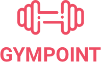

<h1 align="center">
  
</h1>

<h3 align="center">
  Desafio 2: Gympoint, o início
</h3>

<blockquote align="center">“Não espere para plantar, apenas tenha paciência para colher”!</blockquote>

<p align="center">
  

  <a href="https://rocketseat.com.br">
    
  </a>

  

  <a href="https://github.com/Rocketseat/bootcamp-gostack-desafio-02/stargazers">
    
  </a>
</p>

<p align="center">
  <a href="#rocket-sobre-o-desafio">Sobre o desafio</a>&nbsp;&nbsp;&nbsp;|&nbsp;&nbsp;&nbsp;
  <a href="#-entrega">Entrega</a>&nbsp;&nbsp;&nbsp;|&nbsp;&nbsp;&nbsp;
  <a href="#memo-licença">Licença</a>
</p>

## Sobre o desafio

A aplicação que iremos dar início ao desenvolvimento a partir de agora é um app gerenciador de academia, o **Gympoint**.

Nesse primeiro desafio vamos criar algumas funcionalidades básicas que aprendemos ao longo das aulas até aqui.

Você deverá criar do zero a aplicação utilizando o Express, além de precisar configurar as seguintes ferramentas:

- Sucrase + Nodemon;
- ESLint + Prettier + EditorConfig;
- Sequelize (Utilize PostgreSQL ou MySQL);

Durante esse desafio você dará início a um novo projeto no Bootcamp, esse projeto será desenvolvido aos poucos até o fim da sua jornada onde você terá uma aplicação completa envolvendo back-end, front-end e mobile.

Esse projeto faz parte do seu **desafio final** e será utilizado para a **certificação do bootcamp**, então bora pro código!

### Funcionalidades

Abaixo estão descritas as funcionalidades que você deve adicionar em sua aplicação.

#### 1. Autenticação

Permita que um usuário se autentique em sua aplicação utilizando e-mail e uma senha.

- A autenticação deve ser feita utilizando JWT.
- Realize a validação dos dados de entrada;

#### 2. Cadastro e atualização de alunos

Permita que novos usuários se cadastrem na aplicação utilizando nome, e-mail, senha e plano.

O plano corresponde quantos dias da semana o aluno irá frequentar a academia, utilize os valores abaixo:

- `start`: Plano inicial (até 2 dias por semana);
- `gold`: Plano gold (até 4 dias por semana);
- `diamond`: Plano diamante (ilimitado);

Obs.: No sequelize temos um tipo de campo que se chama ENUM que força que um campo tenha apenas valores pré-determinados:

```js
plan: Sequelize.ENUM('start', 'gold', 'diamond');
```

O plano **não é um valor obrigatório** no banco de dados já que administradores da plataforma não terão tal informação;

Para atualizar a senha, o usuário deve também enviar um campo de confirmação com a mesma senha.

- Criptografe a senha do usuário para segurança.
- Realize a validação dos dados de entrada;

## Entrega

Esse desafio **não precisa ser entregue** e não receberá correção, mas você pode ver o resultado do [código do desafio aqui](https://github.com/Rocketseat/bootcamp-gostack-desafio-02). Após concluir o desafio, adicionar esse código ao seu Github é uma boa forma de demonstrar seus conhecimentos para oportunidades futuras.

## :memo: Licença

Esse projeto está sob a licença MIT. Veja o arquivo [LICENSE](LICENSE.md) para mais detalhes.

---

Feito com ♥ by Rocketseat :wave: [Entre na nossa comunidade!](https://discordapp.com/invite/gCRAFhc)
